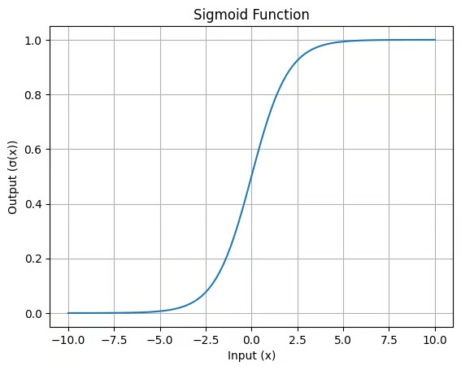

LOGISTIC REGRESSION

What is Logistic Regression?

Logistic regression is a supervised machine learning algorithm mainly used for classification tasks where the goal is to predict the probability that an instance belongs to a given class or not.

It is a type of statistical analysis that helps us understand the relationship between a set of input variables and an output variable that can take on one of two possible values, i.e. yes/no, true/false, 1/0. It does this by estimating the probability that the output variable will take on a certain value given the values of the input variables.

For example, logistic regression could be used to predict whether an email is spam or not based on certain characteristics of the email such as the sender, the subject line, and the content.

Understanding Sigmoid Function

1. The sigmoid function is a important part of logistic regression which is used to convert the raw output of the model into a probability value between 0 and 1.

2. This function takes any real number and maps it into the range 0 to 1 forming an "S" shaped curve called the sigmoid curve or logistic curve. Because probabilities must lie between 0 and 1, the sigmoid function is perfect for this purpose.

3. In logistic regression, we use a threshold value usually 0.5 to decide the class label.

If the sigmoid output is same or above the threshold, the input is classified as Class 1.
If it is below the threshold, the input is classified as Class 0.
This approach helps to transform continuous input values into meaningful class predictions.

